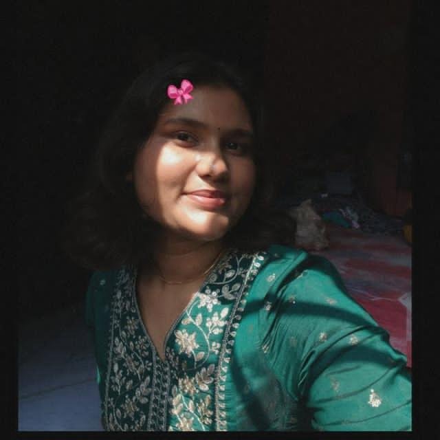
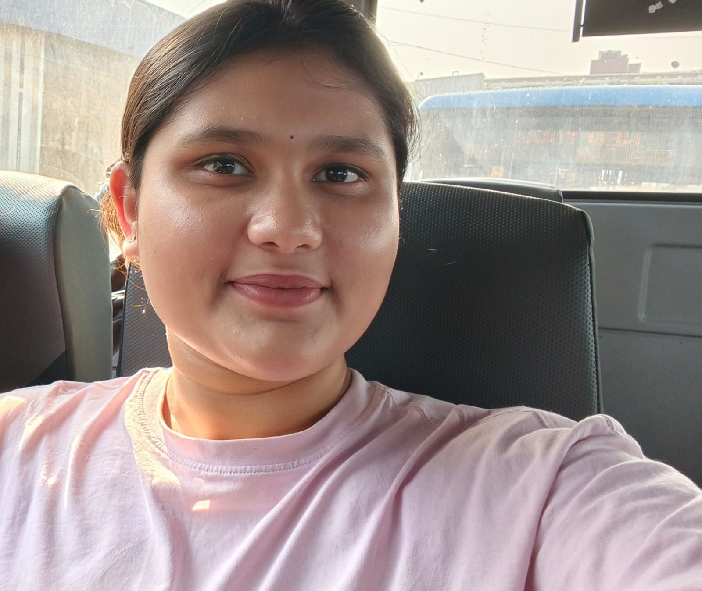

<!DOCTYPE html>
<html lang="en">
<head>
<meta charset="UTF-8">
<meta name="viewport" content="width=device-width, initial-scale=1.0">

<title>Happy Birthday MAHHH BABBYY❤️</title>

</head>
<body>

<!-- =========================
CUSTOMIZATION SECTION
========================= -->

<!-- Replace with her name -->

<select onchange="changeTheme(this.value)">
<option value="pink">Pink</option>
<option value="lavender">Lavender</option>
<option value="blue">Blue</option>
  <option value="red">Red</option>
</select>

<section class="hero">

<h1>Happy Birthday to my BABBYY(HG)❤️</h1>

Happy Birthday to the most special person from my childhood.
  Growing up with you is one of the best part of my life From silly conversations to bestest teas and all the memories we made together Every moment still means a lot to me.
  No matter how much we grow up or how busy life gets You will always be my most important person i never forget.
  Thanks for being there for me and you are the one who supported me a lot, gave me emotional support when i need someone the most.
  Am really lucky to have the bestest friend like you.
  I just hope this year brings you success,happiness,peace and everything your heart wishes for cuz you truely deserve it all Enjoy your day
  fully,smile a lot(MY CUTTIE PIE)
  And Yeah.... Don't forget to send me snaps and fitchecks ❤️ And once again HAPPIEST BIRTHDAY TO YOU.❤️

<a href="#letter">
<button class="btn">
Read My Letter 💌
</button>
</a>

</section>

<section>

<h2>💌 A Letter For You</h2>

 

Happy Birthday to the bestest friend I could ever ask for ❤️

It's hard to put into words how much your friendship means to me.
We've known each other for so many years that you've become a part of some of my happiest memories.
From our childhood days to where we are now, you've always been there for me.

Thank you for always supporting me, especially when I needed it the most.
Whether it was helping me with studies, encouraging me when I felt stressed, listening to my problems, or simply making me smile on a bad day, you've always been someone I could rely on.

I feel really lucky to have a friend like you. You're kind, caring, hardworking, and one of the few people who genuinely want the best for others.
Thank you for being yourself and for making life a little brighter for everyone around you.

I hope this year brings you happiness, success, good health, and all the things you've been wishing for. You deserve every bit of it.

No matter where life takes us in the future, our friendship and the memories we've made together will always be special to me.

Happy Birthday once again. Enjoy your day, keep smiling, and don't forget to send me chatpatte snaps and fitchecks. love you MAAHH BABBYY. 💖✨

</section>

<section>

<h2 style="text-align:center;margin-bottom:30px;">
📸 MAHH CUTTIEPIE
</h2>

<!-- REPLACE THESE FILE NAMES -->

</section>

<section id="letter">

<h2>✨ Things I Want To Say</h2>

 

<ul>

<li>Thank you for being part of my life.</li>
<li>Thank you for every childhood memory.</li>
<li>You deserve happiness and success.</li>
<li>May this year be your best one yet.</li>

</ul>

</section>

<section>

Made with ❤️ for my BABBY(HG)

</footer>

<!-- MUSIC -->

<!-- Replace music.mp3 with your song -->

<audio id="music" loop>
<source src="Kali Uchis - All I Can Say(2).mp3" type="audio/mpeg">
</audio>

<button class="btn music-btn" onclick="toggleMusic()">
🎵 Music
</button>

</body>
</html># index.html
